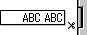
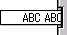
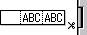
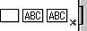

# Notice
Properties are applicable exclusively to models that support each respective function. If a model does not support a particular function, the configuration becomes invalid, even if a prop is specified.

## Supported Ext Types (File Export)
| **Description** | **Extension** |
|---|:---:|
| LBX type | .lbx |
| LBL (P-touch Editor 4.2) | .lbl |
| LBI type | .lbi |
| BMP Image | .bmp |
| PAF Type | .paf |

## Print Option Props
| **Key** | **Type** | **Default** | **Description** |
|---|---|:---:|---|
| copies | number | 1 |Number of copies to print.|
| printName | string | "BPAC-Document" |Document Name for print queue.|
| autoCut | boolean | false |Auto cut after print.|
| cutPause | boolean | false |Pause to cut is applied. Valid only with models not supporting the auto cut function.|
| cutMark | boolean | false |Cut mark is inserted. Valid only with models not supporting the auto cut function.|
| halfCut | boolean | false |Performs half cut.|
| chainPrint | boolean | false |Continuous printing is performed. The final label is not cut, but when the next labels are output, the preceding blank is cut in line with the cut option setting.|
| tailCut | boolean | false |Whenever a label is output, the trailing end of the form is forcibly cut to leave a leading blank for the next label output|
| specialTape | boolean | false |No cutting is performed when printing on special tape. Valid only with PT-2430PC.|
| cutAtEnd | boolean | false |Cut at end is performed.|
| noCut | boolean | false |Disable auto cut|
| mirroring | boolean | false |Mirror print label.|
| quality | boolean | false |Fine quality print.|
| highSpeed | boolean | false |High speed printing.|
| highResolution | boolean | false |High resolution printing.|
| color | boolean | false |Print in color.|
| mono | boolean | false |Print in monochrome.|
| fitPage | boolean | false |Specify whether to adjust the size and position of objects in the template in accordance with layout changes resulting from media changes. If set to true, adjustments will be made; otherwise, if set to false or undefined, no adjustments will be applied..|

## PT-9500PC / PT-9600 / PT-3600 
| **noCut** | **autoCut** | **halfCut** | **cutMark** | **chainPrint** | **cutAtEnd** | **specialTape** | **Result** |
|:---:|:---:|:---:|:---:|:---:|:---:|:---:|---:|
|✔️|-|-|-|-|-|-| |
|-|-|-|-|✔️|-|-| |
|-|-|✔️|-|-|-|-| |
|-|-|✔️|-|✔️|-|-| |
|-|✔️|-|-|-|-|-| |
|-|✔️|✔️|-|-|-|-| |
|-|✔️|✔️|-|✔️|-|-| |

