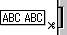
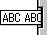

# Notice
Print options apply exclusively to models that support each respective function. If a model does not support a particular function, the configuration becomes invalid, even if the option is true. 

If an option is undefined, the default configuration specified in the template file will be applied.

## Supported Ext Types (exporting files)
| **Description** | **Extension** |
|---|:---:|
| LBX type | .lbx |
| LBL (P-touch Editor 4.2) | .lbl |
| LBI type | .lbi |
| BMP Image | .bmp |
| PAF Type | .paf |

## Print Options
| **Key** | **Type** | **Default** | **Description** |
|---|---|:---:|---|
| copies | number | 1 |Number of copies to print.|
| printName | string | "BPAC-Document" |Document Name for print queue.|
| autoCut | boolean | - |Auto cut after print.|
| cutPause | boolean | - |Pause to cut is applied. Valid only with models not supporting the auto cut function.|
| cutMark | boolean | - |Cut mark is inserted. Valid only with models not supporting the auto cut function.|
| halfCut | boolean | - |Performs half cut.|
| chainPrint | boolean | - |Continuous printing is performed. The final label is not cut, but when the next labels are output, the preceding blank is cut in line with the cut option setting.|
| tailCut | boolean | - |Whenever a label is output, the trailing end of the form is forcibly cut to leave a leading blank for the next label output|
| specialTape | boolean | - |No cutting is performed when printing on special tape. Valid only with PT-2430PC.|
| cutAtEnd | boolean | - |Cut at end is performed.|
| noCut | boolean | - |Disable auto cut|
| mirroring | boolean | - |Mirror print label.|
| quality | boolean | - |Fine quality print.|
| highSpeed | boolean | - |High speed printing.|
| highResolution | boolean | - |High resolution printing.|
| color | boolean | - |Print in color.|
| mono | boolean | - |Print in monochrome.|
| fitPage | boolean | - |Specify whether to adjust the size and position of objects in the template in accordance with layout changes resulting from media changes. If set to true, adjustments will be made; otherwise, if set to false or undefined, no adjustments will be applied..|

## PT-9500PC / PT-9600 / PT-3600 
| **noCut** | **autoCut** | **halfCut**| **chainPrint** | **Result** |
|:---:|:---:|:---:|:---:|---:|
|✔️|-|-|-| |
|-|-|-|✔️| |
|-|-|✔️|-| |
|-|-|✔️|✔️| |
|-|✔️|-|-| |
|-|✔️|-|✔️| |
|-|✔️|✔️|-| |
|-|✔️|✔️|✔️| |

## PT-9700PC / PT-9800PCN / PT-P750W / PT-P910BT / PT-E550W 
| **noCut** | **autoCut** | **halfCut** | **chainPrint** | **specialTape** | **Result** |
|:---:|:---:|:---:|:---:|:---:|---:|
|✔️|-|-|-|-| |
|-|-|-|✔️|-| |
|-|-|✔️|-|-| |
|-|-|✔️|✔️|-| |
|-|✔️|-|-|-| |
|-|✔️|-|✔️|-| |
|-|✔️|✔️|-|-| |
|-|✔️|✔️|✔️|-| |
|-|-|-|-|✔️| |

## PT-D450
| **noCut** | **cutMark** | **chainPrint** | **Result** |
|:---:|:---:|:---:|---:|
|✔️|-|-| |
|-|-|✔️| |
|-|✔️|-| |
|-|✔️|✔️| | 

## PT-E800T / PT-E800TK / PT-E850TKW
| **Media** | **noCut** | **autoCut** | **halfCut** | **chainPrint** | **specialTape** | **Result** |
|:----------|:---:|:---:|:---:|:---:|:---:|---:|
| TZe       |✔️|-|-|-|-| |
| TZe       |-|-|-|✔️|-| |
| TZe       |-|-|✔️|-|-| |
| TZe       |-|-|✔️|✔️|-| |
| TZe       |-|✔️|-|-|-| |
| TZe       |-|✔️|-|✔️|-| |
| TZe       |-|✔️|✔️|-|-| |
| TZe       |-|✔️|✔️|✔️|-| |
| TZe       |-|-|-|-|✔️| |
| PVC Tube  |✔️|❌|-|❌|❌| |
| PVC Tube  |-|❌|✔️|❌|❌| |
| FLe       |✔️|-|❌|❌|❌| |
| FLe       |-|✔️|❌|❌|❌| |

## PT-D800W / PT-P900 / PT-P900W / PT-P950NW
| **Media** | **noCut** | **autoCut** | **halfCut** | **chainPrint** | **specialTape** | **Result** |
|:----------|:---:|:---:|:---:|:---:|:---:|---:|
| TZe       |✔️|-|-|-|-| |
| TZe       |-|-|-|✔️|-| |
| TZe       |-|-|✔️|-|-| |
| TZe       |-|-|✔️|✔️|-| |
| TZe       |-|✔️|-|-|-| |
| TZe       |-|✔️|-|✔️|-| |
| TZe       |-|✔️|✔️|-|-| |
| TZe       |-|✔️|✔️|✔️|-| |
| TZe       |-|-|-|-|✔️| |
| FLe       |✔️|-|❌|❌|❌| |
| FLe       |-|✔️|❌|❌|❌| |

## PT-2100 / PT-2700 / PT-24 / PT-18R / PT-18NR
| **noCut** | **autoCut** | **chainPrint** | **Result** |
|:---:|:---:|:---:|---:|
|✔️|-|-| |
|-|-|✔️| |
|-|✔️|-| |
|-|✔️|✔️| |

## PT-1950 / PT-1960
| **noCut** | **cutMark** | **chainPrint** | **Result** |
|:---:|:---:|:---:|---:|
|✔️|-|-| |
|-|-|✔️| |
|-|✔️|-| |
|-|✔️|✔️| | 

## PT-1230PC
| **noCut** | **cutMark** | **Result** |
|:---:|:---:|---:|
|✔️|-| |
|-|✔️| |

## PT-2600 / PT-2610
| **noCut** | **autoCut** | **Result** |
|:---:|:---:|---:|
|✔️|-| |
|-|✔️| |

## PT-2430PC / PT-2730 / PT-P700 / PT-P710BT / PT-P715eBT / PT-H500 / PT-E500 / PT-D600 / PT-D610BT
| **noCut** | **autoCut** | **chainPrint**| **specialTape** | **Result** |
|:---:|:---:|:---:|:---:|---:|
|✔️|-|-|-| |
|-|-|-|✔️| |
|-|-|✔️|-| |
|-|✔️|-|-| |
|-|✔️|✔️|-| |

## PT-D410/PT-D460BT
| **noCut** | **cutPause** | **chainPrint**| **specialTape** | **Result** |
|:---:|:---:|:---:|:---:|---:|
|✔️|-|-|-| |
|-|-|✔️|-| |
|-|✔️|-|-| |
|-|✔️|✔️|-| |
|-|-|-|✔️| |

## MW-100e / MW-120 / MW-140BT / MW-145BT / MW-170 / MW-260 / MW-270 / PJ-623 / PJ-663 / PJ-722 / PJ-723 / PJ-762 / PJ-763 / PJ-763MFi / PJ-773 / RJ-2030 / RJ-2150 / RJ-2140 / RJ-2050 / RJ-3050 / RJ-3050Ai / RJ-3150 / RJ-3150Ai / RJ-3230B / RJ-3250WB / RJ-4030 / RJ-4030Ai / RJ-4040 / RJ-4230B / RJ-4250WB / PJ-822 / PJ-823 / PJ-862 / PJ-863 / PJ-883 / TD-2020 / TD-2120N / TD-2130N / TD-2030A / TD-2125N / TD-2125NWB / TD-2135N / TD-2135NWB
| **noCut** | **Result** |
|:---:|---:|
|✔️| |

## QL-550 
| **noCut** | **autoCut** | **Result** |
|:---:|:---:|---:|
|✔️|-| |
|-|✔️| |

## QL-560 / QL-570 / QL-580N / QL-600 / QL-650TD / QL-700 / QL-710W / QL-720NW / QL-800 / QL-810W / QL-820NWB / QL-1050 / QL-1060N / QL-1100 / QL-1110NWB / QL-1115NWB / TD-4000 / TD-4100N / TD-4410D / TD-4420DN / TD-4510D / TD-4520DN / TD-4550DNWB / TD-4210D / TD-4420TN / TD-4520TN / TD-4650TNWB / TD-4750TNWB / TD-4650TNWBR / TD-4750TNWBR / TJ-4010TN / TJ-4005DN / TJ-4020TN / TJ-4021TN / TJ-4021TNR / TJ-4120TN / TJ-4121TN / TJ-4121TNR / TJ-4420TN / TJ-4422TN / TJ-4520TN / TJ-4522TN / TJ-4620TN
| **noCut** | **autoCut** | **cutAtEnd** | **Result** |
|:---:|:---:|:---:|---:|
|✔️|-|-| |
|-|-|✔️| |
|-|✔️|-| |
|-|✔️|✔️| |