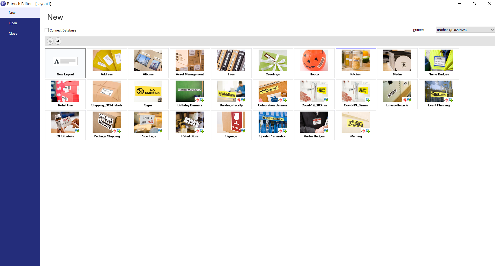
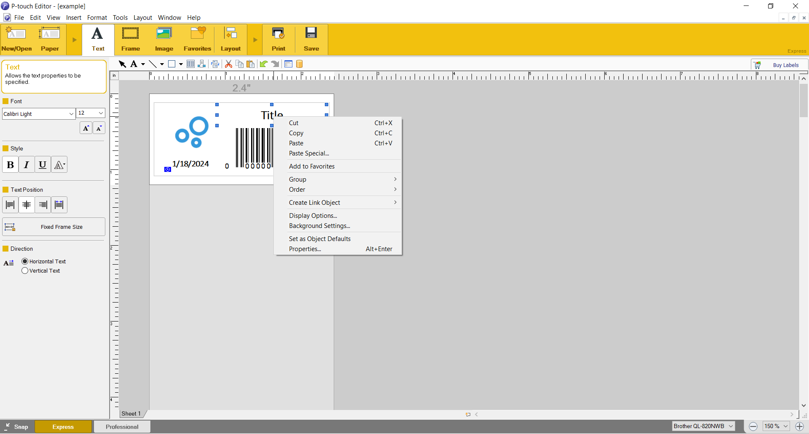

# Introduction
In order to create templates and modify text field and other objects you will need to have Brother P-Touch Editor installed.

## Template Setup

1. Insure the correct printer is selected from the dropdown on the top right.
1. Select "New Layout" to create a custom layout or select from one of the pre-defined templates.

1. Create all the required elements.
1. Position all elements with enough space to insure no overlaps occur.
1. Right click on each element and select properties.

1. Select the expanded tab
1. Give each element an object name (tip: do not use spaces or hyphens. Camel case or snake case is recommended.)
1. ⚠️ **Important**: The object name is what maps each key/value to the templates elements. They need to match.
1. It may be a good idea to print the template to insure the elements display correctly.
1. Save your file.

## Supported Template Objects

| **Object** | **Type** | **Example** |
|---|---|---|
| Text | String | "My Label" |
| Date | JS Date Object | new Date("2024-01-22") |
| Barcode | String | "826218016158" |
| Image | String | "C:/Photos/shoe.png" |
| Clipart | N/A | Not Supported |
